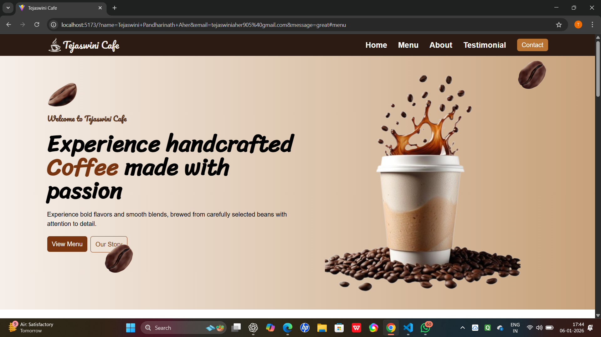
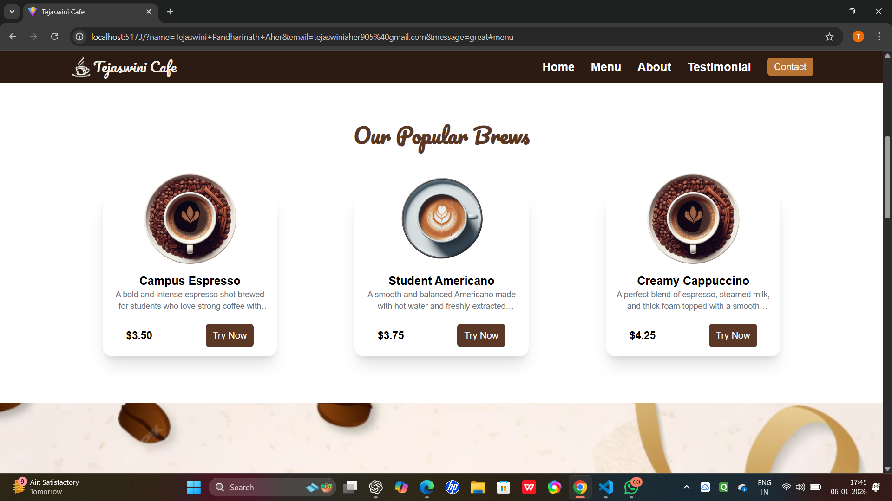
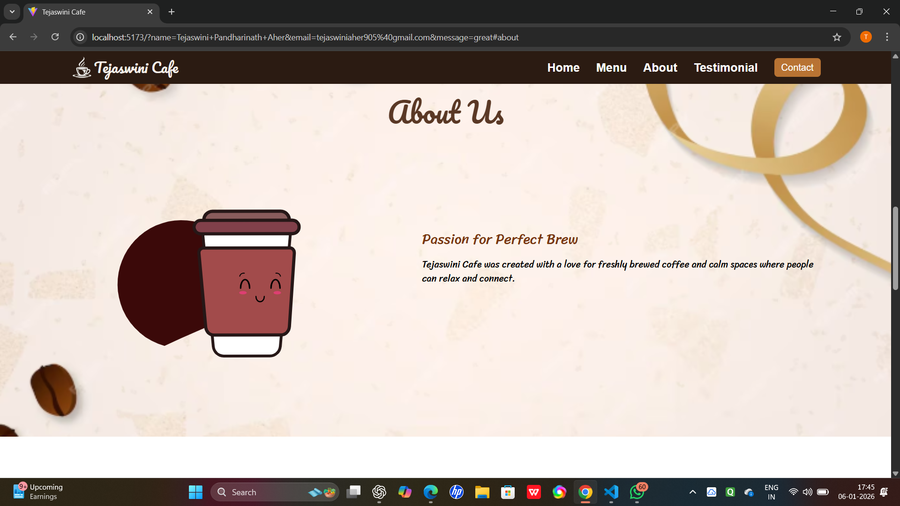
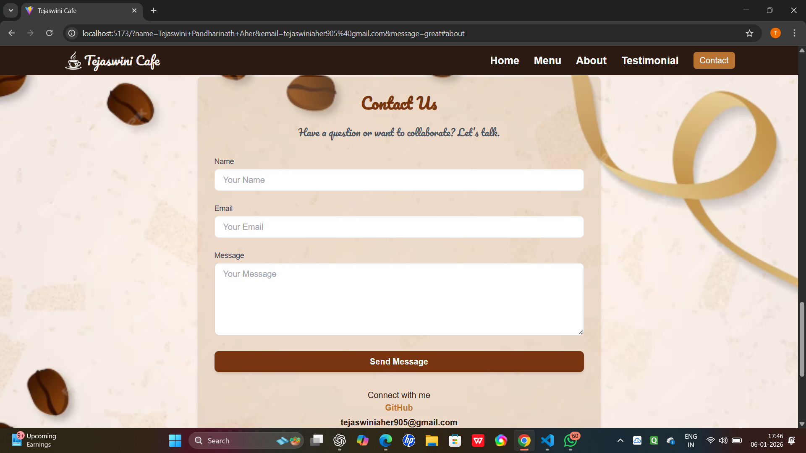
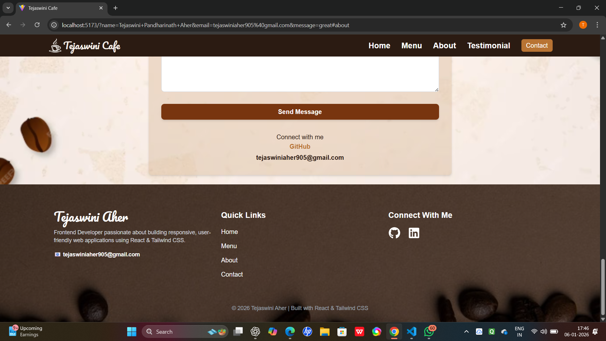

☕ Coffee Shop Web Application

A modern and responsive coffee shop website built using React.js and Tailwind CSS.
This project focuses on clean UI design, smooth animations, and reusable component architecture.

📸 Preview
<p align="center">
  
  
  
  
  
</p>


## 🚀 Features
- Fully responsive design (mobile, tablet, desktop)
- Modern UI with custom color palette suitable for a coffee brand
- Smooth scroll-based animations using Framer Motion
- Reusable React components
- Interactive menu section with product cards
- Testimonial slider using React Slick
- Clean footer with personal branding
- Optimized development using Vite


## 🛠 Tech Stack
- React.js
- Tailwind CSS
- Vite
- Framer Motion
- React Slick
- Lucide React / React Icons


```
## 📂 Project Structure

src/
│── assets/
│── components/
│   ├── Navbar.jsx
│   ├── Hero.jsx
│   ├── Menu.jsx
│   ├── About.jsx
│   ├── Testimonials.jsx
│   ├── Contact.jsx
│   ├── Footer.jsx
│   └── ResponsiveMenu.jsx
│
│── App.jsx
│── index.css
│── main.jsx

```